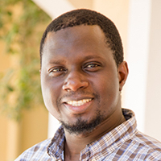
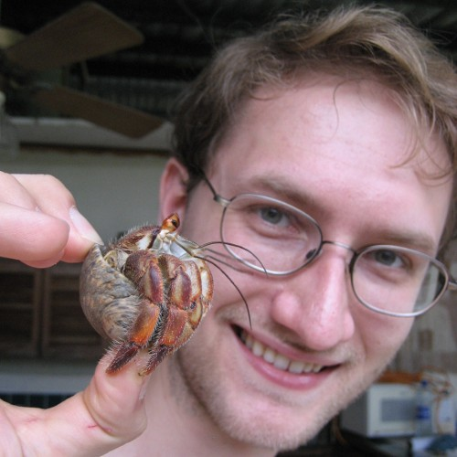
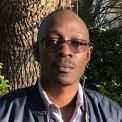
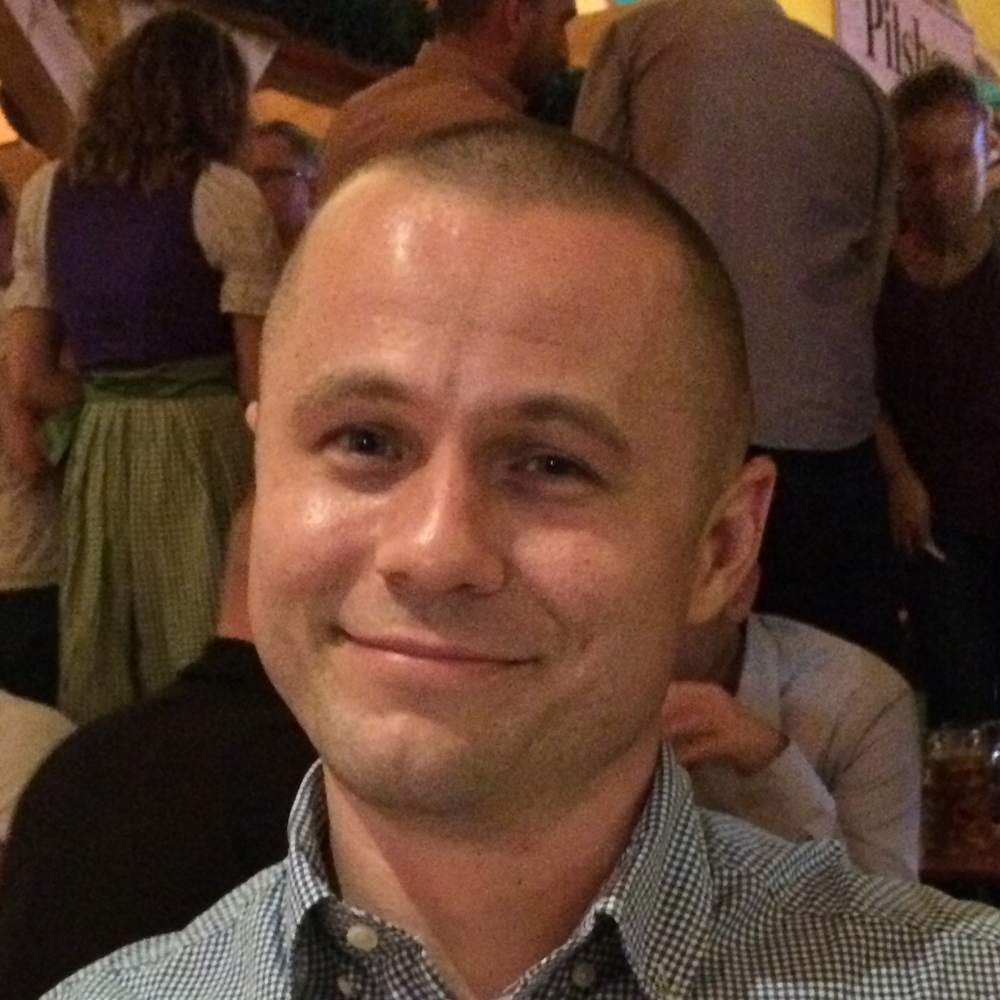
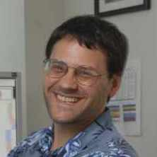
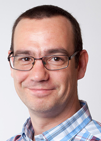

{::options parse_block_html="true" /}

 -  Bubacarr Bah
   * [google scholar](https://scholar.google.co.za/citations?user=Y_bXZfMAAAAJ), [homepage](https://sites.google.com/aims.ac.za/bubacarr)
   * AIMS South Africa, German Research Chair of Mathematics with specialization in Data Science
 -  Thomas J. Hladish
   * [google scholar](https://scholar.google.com/citations?user=Ncv6hnMAAAAJ)
   * University of Florida, Research Assistant Scientist
 -  Perceval Maturure
   * SACEMA, Technical Officer
 -  Carl A. B. Pearson
   * [google scholar](https://scholar.google.com/citations?user=XKRJAXwAAAAJ)
   * USAFRICOM, Science & Technology Liaison Officer
 -  Arlin Stoltzfus
   * [home page](http://www.molevol.org/), [github](https://github.com/arlin)
   * Institute for Bioscience and Biotechnology Research & Office of Data and Informatics, National Institute of Standards and Technology

<!--
-  Jan Groenewald
  * AIMS IT Manager
-->